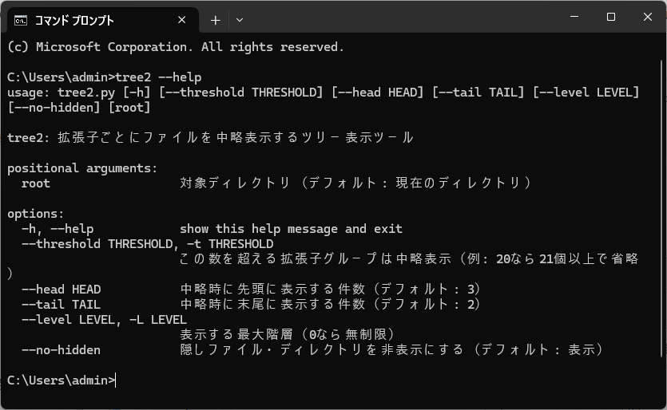

# tree-command

拡張子ごとにファイルをグループ化し、**大量のファイルは中略して表示するツリー表示ツール**です。  
中略部分はプレーンテキストで表示され、例えば以下のようになります:

... (304 .tif files total)


## 使い方

```powershell
tree2 C:\path\to\dir --threshold 50 --head 3 --tail 2
```

## オプション

 - --threshold / -t  
 1つの拡張子グループに含まれるファイル数がこの数を超えると中略します（デフォルト: 10）
 - --head  
 中略時に先頭に表示する件数（デフォルト: 3）
 - --tail  
 中略時に末尾に表示する件数（デフォルト: 2）
 - --level / -L  
 表示する最大階層。
 --level 1 ならルート直下だけ、--level 2 ならサブディレクトリ1段階まで。
デフォルトは 0（無制限）。
 - --no-hidden  
 隠しファイル・ディレクトリを非表示にします。
デフォルトでは 表示 されます。


## Windows への簡単インストール方法

1. 任意の場所にフォルダを作成します（例: C:\Users\<username>\bin）

2. このフォルダに tree2.py をコピーします

3. 同じフォルダに tree2.bat を作成し、内容を以下のようにします:

```
@echo off
python "%~dp0tree2.py" %*
```

4. 環境変数 PATH に C:\Users\<username>>\bin を追加します
（コントロールパネル → システム → 詳細設定 → 環境変数）

5. 新しい PowerShell を開いて動作確認します:
```
tree2 --help
```



## 表示例

```
CellStatsDir/
└── Morphology2D/
    ├── 20221008_005902_S2_C902_P99_N99_F001.TIF
    ├── 20221008_005902_S2_C902_P99_N99_F002.TIF
    ├── 20221008_005902_S2_C902_P99_N99_F003.TIF
    ... (304 .tif files total)
    ├── 20221008_005902_S2_C902_P99_N99_F303.TIF
    ├── 20221008_005902_S2_C902_P99_N99_F304.TIF
    └── Thumbs.db
```

## 注意

罫線（├──, └──, │）が文字化けする場合は PowerShell を使用してください

CMD を使う場合は chcp 65001 で UTF-8 に切り替えると改善することがあります


